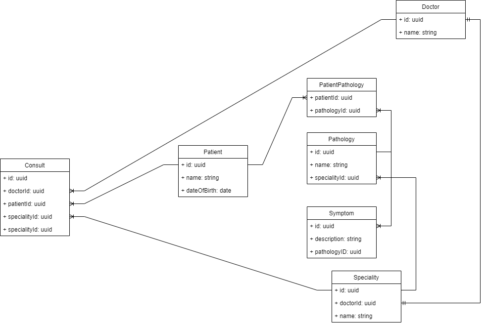

# **Getting Started**

### **What this is**

This project is a simple Rest webservice for a tech challenge. In this project is a Springboot application, with a Postgres database, orchestrated with docker.
The objective is to create a simple webservice with an API to get, insert, update and delete information.

It's a simple case of a hospital, that needs management of patients, doctors and consults. Every consult must have a doctor, speciality and patient associated.

### **Entity Relation Diagram**

<br/>

### **Requirements**

 - Maven
 - Java 17
 - Docker

### **Start-up**

Run the following commands in the command line:

    - mvn clean install 
    - docker build -t challenge-1.0.0.jar .
    - docker-compose up

When everything is up and running, go to your browser and acess to the swagger with this URL http://localhost:8080/challenge/swagger-ui/index.html too start using the endpoints.
You can also use postman if you prefer.

### **Endpoints**

Note: the IDs are created automatically with UUID type.

#### **Create a Doctor**
Use this URL /challenge/v1/doctor its a POST method to create a doctor.
```JSON
  {
  "id": "3fa85f64-5717-4562-b3fc-2c963f66afa6",
  "name": "string"
  }
```
#### **Create a Speciality**
Use this URL /challenge/v1/speacialities its a POST method to create a speaciality, you will need to insert an existant UUID of a doctor. 

#### **Create a Pathology**
Use this URL /challenge/v1/pathologies its a POST method to create a pathology, you will need to insert an existant UUID of a speciality. 

#### **Create a Symptom**
Use this URL /challenge/v1/symptoms its a POST method to create a symptom, you will need to insert an existant UUID of a pathology. 

#### **Create a Patient**
Use this URL /challenge/v1/patients its a POST method to create a patient, you will need to insert at least one existant UUID of a pathology, you can add more because a patient can have multiple pathologies. 

#### **Create a Consult**
Use this URL /challenge/v1/consults its a POST method to create a consult, you will need to insert an existant UUID of a doctor, speciality and a patient. 


